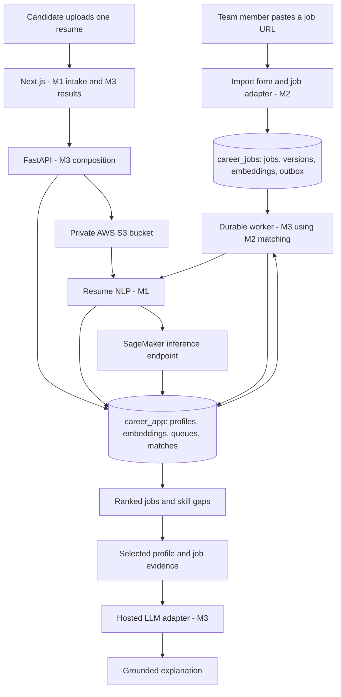

# AI Career Match - Project Plan

**Last updated:** 2026-09-08

**Team:** 3 members

**Current milestone:** SET-01 and initial SET-02 are published on `main` (`0a00918`, `858c58b`). A-01 is merged on `main`. Manual URL imports and cloud deployment are planned, not implemented; the 2026-09-08 revision restores AWS S3 storage and SageMaker model hosting as required infrastructure.

**Document maintainer:** M3 after bootstrap; this scope revision is requested by Plai (M1). Serialize subsequent shared-document edits through M3.

**Purpose:** The central record of scope, ownership, interfaces, milestones, progress, decisions, and release readiness.

**Navigation:** [Scope](#1-source-of-truth-and-current-repository) | [Architecture](#2-proposed-architecture-and-technology-stack) | [Contracts](#3-contracts-that-allow-parallel-implementation) | [Member assignments](#4-responsibilities-for-the-three-members) | [Coordination](#5-shared-work-and-coordination-rules) | [Milestones](#6-development-phases-and-milestones) | [Git workflow](#7-git-and-github-workflow) | [Testing](#8-testing-and-validation) | [Progress tracker](#9-project-progress-tracker) | [Release checklist](#10-final-integration-and-deployment-checklist)

**Start here, Plai:** review/merge A-01, then start A-02. M2 can start B-09 and investigate B-01 now; M3 takes shared contracts and C-01. See [START_HERE.md](START_HERE.md) for updated task orders and prompts. The existing remote is [ncwjsp/ai-career-match](https://github.com/ncwjsp/ai-career-match); do not recreate the bootstrap or remote.

## 1. Source of truth and current repository

This plan is based on all 10 slides, their speaker notes, and all 5 pages of the speaker script. References below use **S1-S10** for presentation slides and **P1-P5** for script pages.

- **Presentation:** `AI_Career_Match_Presentation.pptx`, supplied at `C:/Users/User/Downloads/AI_Career_Match_Presentation.pptx`.
- **Script:** `new.pdf`, supplied at `C:/Users/User/Downloads/new.pdf`. This is the full speaker script, including the research comparison and likely questions.
- **Repository inspection:** the project started empty. `main` now contains the Next.js/TypeScript/Tailwind and FastAPI shells, pinned dependencies, owner folders, canonical DTOs/interfaces, generated OpenAPI/frontend types, synthetic fixtures, and two matching-trigger tests. Local `career_app`/`career_jobs` role isolation and independent migration runners were verified on 2026-09-07. Domain folders mostly remain scaffolds; planned product endpoints return 501. A-01 extraction is on the separate published feature branch, not yet merged. There is no implemented scheduled crawler or AWS deployment to remove. Bootstrap test results are historical evidence, not production readiness or confirmation of GitHub CI. See [bootstrap evidence](docs/integration/BOOTSTRAP_HANDOFF.md).

The documents define product requirements. Speaker handoffs, presentation timing, bracketed stage directions, and instructions about shortening the talk are presentation material, not development instructions. Technical choices introduced by this plan are labeled as proposals. The sources do not establish a deadline, cloud budget, model choice, supported languages, or access to any job platform.

**User clarification, 2026-09-05:** the user is Plai (M1). Matching must run independently of resume uploads so newly collected company jobs are also matched to existing candidates. Collected jobs must live in their own database, and the plan must specify a usable matching-score formula. These explicit requirements extend the presentation/script and supersede the earlier single-database proposal. They do not imply an employer posting portal; new postings enter through permitted source ingestion.

**User scope revision, 2026-09-07:** replace scheduled job collection with a small manual job-URL import/update flow. Prefer Railway as the simpler deployment target. This supersedes the schedule in S6/P3 and the AWS services in S9/P4-P5; the source documents are preserved as historical inputs, not edited to imply they proposed Railway. The core NLP, scoring, research, two-database separation, and both matching triggers remain required. Proposed access rule: team/admin imports jobs into the shared corpus; candidates still need only one resume. This access assumption can be revised before SET-02 import contracts are frozen.

**Team scope revision, 2026-09-08 (relayed by M3/Nai):** the team decided to use **AWS S3** for resume object storage and **Amazon SageMaker** for NLP/embedding model hosting. This restores part of the S9/P4-P5 infrastructure that the 2026-09-07 revision had removed. It changes infrastructure only:

- `ObjectStore` gains an S3 adapter; the local filesystem adapter stays for tests, offline development and CI. Original resumes remain private and are read through the application.
- Embedding/NLP inference gains a SageMaker endpoint adapter behind the existing `Embedder` port. The local CPU adapter stays and A-07 parity is now checked **local versus SageMaker**.
- **OpenSearch and Bedrock remain out of the MVP.** Retrieval stays stored vectors plus exact cosine in PostgreSQL (B-03), and explanation generation stays provider-neutral (C-02); Bedrock only becomes one permitted provider option now that an AWS account exists.
- The `career_app`/`career_jobs` separation, manual URL imports, both matching triggers, the 70/30 formula and the research scope are unchanged.
- Where web/API/worker/PostgreSQL are hosted is **not settled by this revision** and stays open in D07: Railway remains viable alongside the AWS services, and an AWS-native host is now also possible. Cross-provider egress and latency must be measured before that choice is frozen.
- An AWS account, budget owner and credential policy are now prerequisites. Required environment variables are listed in `services/backend/.env.example`; no key is committed.

Keep source references stable. At setup, record a team-accessible location and checksum for each original file in `docs/sources/README.md`; do not depend on one member's Downloads folder. Store a shared copy only if appropriate for the repository's visibility.

### Overview and objectives

AI Career Match is an NLP-based personalized job recommendation project for the Assumption University NLP course. A candidate uploads **one resume**. The system automatically builds and retains a structured candidate profile, searches many current job postings, ranks relevant opportunities, and explains the match and skill gaps for each recommendation. The candidate can then select a recommended job for more detail. [S1-S4, P1-P2] While the profile remains active under the agreed retention policy, newly ingested jobs trigger additional matching and refresh that candidate's recommendations without another upload. [User clarification]

The objectives are to reduce repetitive manual job searching, recognize equivalent skills expressed differently, make opportunities easier to compare, and expose strengths and missing skills. The project also has a research objective: compare five matching approaches on the same evaluation data rather than claim improvements before measuring them. [S2, S7-S8, P4-P5]

### Required scope and traceability

| ID | Requirement from the sources | Implementation coverage | Source |
| --- | --- | --- | --- |
| R01 | One resume triggers analysis, search, matching, ranking, and recommendations automatically. No required company choice, target job title, or pasted job description. | A-05/A-06, C-03/C-05: upload, orchestration, results navigation | S3-S4; P1-P2, P5 |
| R02 | Accept a PDF or Word resume and extract, clean, tokenize, and normalize its text. | A-01/A-02: resume parsers and shared preprocessing | S4; P2 |
| R03 | Extract skills, education, job titles, companies/organizations, years of experience, and projects into a candidate profile. Apply POS tagging and NER. | A-02/A-03: candidate NLP and evidence-bearing profile | S4-S5; P2-P3 |
| R04 | Maintain a shared corpus by manually importing individual permitted job URLs; re-import a URL to update its posting. | B-01/B-02/B-09, C-03: approved sources, import form/API, stored jobs | User revision 2026-09-07 supersedes schedule in S6/P3 |
| R05 | Process job descriptions consistently with resumes; extract title, skills, and requirements; embed and index postings. | A-02/A-04, B-02/B-03: shared NLP, job normalization, indexing | S4-S6; P2-P3 |
| R06 | Retrieve relevant jobs at scale and rank them by semantic fit. | B-03/B-04/B-05: retrieval and matching algorithms | S5, S7; P3-P4 |
| R07 | Give ranked jobs a match percentage based on semantic similarity and required-skill coverage, with weights evaluated experimentally. | B-05/B-06/B-08, C-04: scoring, evaluation, ranked results | S7-S8; P4-P5 |
| R08 | Show present, partially matched, and missing skills; strengths; skill gaps; and a written explanation when a job is selected. | B-06, C-02/C-04: skill comparison, explanation, detail UI | S8; P4 |
| R09 | Ground generated explanations in the actual resume and selected job text using RAG and an LLM. | C-02, VAL-01: context retrieval, generation and grounding review | S5, S9; P3-P5 |
| R10 | Provide concise resume and job-description summaries. The script explicitly describes user-facing job summaries. | A-03/A-06, B-02, C-04: summaries and display | S5; P3 |
| R11 | Apply LDA topic modeling to job-market topics and skill clusters. | B-07: offline corpus analysis and documented findings | S5; P3 |
| R12 | Compare keyword matching, TF-IDF with cosine similarity, sentence embedding similarity, transformer-based matching, and hybrid re-ranking. | B-04/B-05/B-08: five reproducible experiments | P4 |
| R13 | Evaluate precision, recall, F1, and human judgment of ranked lists. | B-08, VAL-01: benchmark, metrics, human review, report | P4-P5 |
| R14 | Keep Next.js/FastAPI/NLP and PostgreSQL; store resumes in a private AWS S3 bucket, host NLP/embedding inference on a SageMaker endpoint, and keep a provider-neutral LLM adapter with local adapters for tests. | A-04/A-07, B-03, C-01/C-02/C-06, INT-02 | S9, P4-P5 for S3/SageMaker; team revision 2026-09-08. Hosting of web/API/worker/PostgreSQL stays open in D07 |
| R15 | Treat JobThai, JobsDB, company career pages, and public APIs/feeds as candidates; use only where Terms of Service, robots.txt, and API policies permit, respecting rate limits. Treat slide companies and percentages as mock data. | B-01/B-02/B-08, C-04, REL-01: provenance, labeling, reporting | S6-S8; P3-P5 |
| R16 | Separate resume processing from matching; new or updated jobs must be matched against retained active candidate profiles automatically. | B-10, C-08, INT-01/INT-02: incremental matching and result refresh | User clarification, 2026-09-05 |
| R17 | Store scraped/retrieved job data in its own database, independently of resumes and candidate/application data. | B-09, C-01/C-06: separate job/application databases and connections | User clarification, 2026-09-05 |

### Scope boundaries and unresolved details

- Machine translation, ASR/text-to-speech, and Naive Bayes/classification are **optional extensions**, explicitly outside the core architecture. Do not schedule them ahead of required work. [S5, P3]
- Accounts, an employer portal, application submission, saved-job collections, notifications, chat, resume rewriting, and salary prediction are outside the supplied requirements. An anonymous session for isolating uploaded data is a proposed implementation safeguard, not a new account feature.
- **Proposed initial formats:** text-based PDF and `.docx`. Confirm whether the script's “Word file” also requires legacy `.doc` before freezing acceptance criteria. Scanned PDFs need an explicit OCR decision; until supported, detect them and return a useful error instead of an empty profile.
- **Language scope is unresolved:** do not infer English-only or Thai support from the candidate source list. Decide supported resume/job languages before selecting models and a live source. English fixtures may support early development but do not establish final language coverage.
- LDA is required course work, but the sources do not request an analytics dashboard. Deliver an analysis artifact/report and assess useful clusters without making topics an unvalidated ranking requirement.
- The mock 94%, 91%, and other slide percentages are neither target accuracy nor values to hard-code. Match percentages describe a scoring function, not a probability of getting hired.
- Keep the model lifecycle reproducible with local/offline scripts and versioned CPU model artifacts. Begin with pretrained models, evaluate and deploy the selected model, and prepare a training/fine-tuning path. Whether to actually fine-tune is an evidence-and-budget decision; report honestly which stages were executed.

## 2. Proposed architecture and technology stack

Use the existing monorepo: one Next.js app and one modular Python package, run as separate API and worker processes. Manual collection reduces maintenance; a durable worker still performs NLP and matching after the importing user leaves.



### Manual job import and update flow

1. A team member opens the small protected import page, pastes one supported job URL, and submits. M2 owns the feature component and backend importer; M3 owns route wiring and the server-side access guard. Candidate users do not need to supply a URL.
2. Validate the URL against approved source rules, enqueue a bounded import, and show its status. Fetch only that job page or its permitted official API equivalent. No site-wide crawling, source-discovery loop, cron, or scheduled refresh is required.
3. Normalize the posting, extract requirements and summary using shared NLP, preserve evidence/provenance, and save the job in `career_jobs`. Canonical URL/source identity plus a content hash avoids duplicates. An unchanged re-import updates successful-check metadata without producing a redundant change event; a meaningful change creates a new immutable version.
4. Commit the version and `job.created`/`job.updated` outbox event in the same job-database transaction. The worker prepares its compatible embedding, matches retained candidates, and publishes updated recommendations automatically.
5. To refresh, submit the same URL again. Provide a small team-only action to mark a stored posting closed/inactive, with an event to invalidate recommendations. Failed or blocked fetches preserve the last usable snapshot and report the failed check; they never silently remove jobs.

Show source link, last successful fetch/check, and known expiry. Job availability reflects the last manual check, not continuous monitoring. Enforce explicit expiry and the agreed stale cutoff on reads and before match publication. A company post is discovered only when someone imports its URL: measure **submission-to-results latency**, not an imaginary source-sync interval. Seed enough permitted jobs before demonstrating the candidate flow; show a useful empty-corpus state otherwise.

Use one approved source adapter first plus synthetic HTML/API fixtures. JobThai and JobsDB remain candidate sources subject to permission and technical feasibility; a pasted URL does not guarantee the page permits automated retrieval or can be parsed. Unsupported, blocked, sign-in-only, or unreadable pages need clear errors. Do not add an anti-bot bypass or a browser-crawling fleet. URL fetch tests must cover source allowlists, HTTP(S) only, public addresses, redirect/DNS revalidation, private/loopback/metadata destinations, request timeouts, response-size caps, and rate limits. These checks are required because the backend will fetch a user-supplied URL.

### Two independent matching triggers

1. **Profile ready:** parse the uploaded resume once, retain its versioned profile/embedding in `career_app`, and queue `profile.ready`. Match this profile to active stored jobs. Upload/parser code does not own ranking.
2. **Job created/updated:** a successful manual import persists the job version and durable event. Match it against retained active profiles in bounded batches, reusing stored embeddings and the same `score_pair` function. Do not reparse resumes or require another upload or an open browser.
3. **Job expired/removed:** invalidate affected recommendations/explanations. Reads always exclude expired/inactive postings even before cleanup processes the event.

Start with all active profiles for each changed job, with a measured corpus/workload limit. Do not silently drop candidates through an arbitrary reverse shortlist. Persist match keys containing candidate/profile/job/scoring versions; skip obsolete events and re-check activity before committing. Publish coherent recommendation revisions and bind pagination to a revision. The browser polls while open and fetches the latest revision when the retained session returns.

Retained profiles include stable `candidate_id`, `profile_version`, `matching_enabled`, and `expires_at`, scoped to their session. D06 must set retention and deletion behavior. Expiry/deletion stops matching and removes private derivatives; anonymous sessions do not imply indefinite or cross-device access.

### Separate databases and reliable handoff

| Store | Contents | Owner |
| --- | --- | --- |
| PostgreSQL `career_jobs` / `JOB_DATABASE_URL` | Approved sources, permitted posting snapshots, jobs/versions, requirements/evidence, job embeddings, manual import runs/check metadata, transactional outbox | M2 schemas, repositories and migrations |
| PostgreSQL `career_app` / `APP_DATABASE_URL` | Sessions, upload metadata, retained profiles/embeddings, analysis/match queues, processed events, pair scores, recommendation revisions, explanations | M3 schemas, repositories and migrations; M1 uses interfaces |
| Private AWS S3 bucket | Original resumes available to API and worker through `ObjectStore`; configured retention, opaque keys, versioning and block-public-access | M3 adapter/provisioning; local filesystem adapter remains available for tests/offline work |

One PostgreSQL service hosts both logical databases with distinct roles, connection URLs and migration chains. There are no cross-database foreign keys or SQL joins: consumers resolve versioned IDs through repositories. Database provisioning is M3's infrastructure task; M2 alone edits the job schema/history.

The job version and outbox event commit atomically. M3's dispatcher copies committed events to a PostgreSQL-backed queue in `career_app`, acknowledges only after durable insertion, and retries safely with unique event IDs. Worker leases, bounded retries, checkpoints and idempotent match upserts handle restarts. A lightweight persistent worker polls pending work; this is queue consumption, not scheduled job scraping. Run recovery reconciliation on startup or an explicit operator command, and perform retention cleanup through bounded worker maintenance/operator commands. No external cron or Redis service is required for the MVP.

### Stack and service responsibilities

| Area | Proposed implementation | Owner |
| --- | --- | --- |
| Web/API | Existing pinned Next.js, TypeScript, Tailwind and FastAPI/Python workflows; keep lockfiles | M3 shared setup; domain owners implement features |
| NLP/embeddings | spaCy/Hugging Face/Sentence Transformers/PyTorch as selected and pinned in SET-03. Deployed inference runs on a SageMaker endpoint behind the `Embedder` port; the in-process CPU model stays available for tests/offline runs | M1 shared preprocessing/embedding and packaging; M2 ranking; M3 endpoint adapter/provisioning |
| Search | Store versioned vectors in the respective PostgreSQL databases; exact batched cosine retrieval in `app/search/` for the small corpus | M2; M3 supplies candidate repository |
| Storage and queues | Two PostgreSQL databases with distinct roles plus a private AWS S3 bucket; database outbox/queues | M2 job data; M3 app data and infrastructure |
| Explanations | Provider-neutral hosted LLM API with evidence retrieval, structured validation, on-demand caching and request/token limits | M3; provider/model selected in SET-03 |
| Research/model lifecycle | Local/offline five-method experiments, LDA, evaluation and optional evidence-justified fine-tuning; deploy only the selected CPU inference artifacts | M1 packaging; M2 evaluation/ranking |
| Hosting | Web, API, CPU worker and PostgreSQL on the host chosen in D07; AWS S3 and the SageMaker endpoint regardless of that choice | M3 |

AWS S3 and a SageMaker inference endpoint are required by the 2026-09-08 revision, so an AWS account, region and credential policy are prerequisites. **OpenSearch, Bedrock and scheduled source collection stay out of the MVP.** Retrieval remains stored vectors plus exact batched cosine; optional pgvector or a managed search service can be evaluated only if measured corpus size/latency warrants it. Bedrock is permitted as one provider behind the neutral LLM adapter but is not required.

One private S3 bucket gives the API and worker shared access to uploaded originals; separate service filesystems do not share uploads. Block public access, enable default encryption and versioning, keep object keys opaque, and authorize every read through the application rather than a presigned public link. Scope credentials to that bucket prefix with an IAM policy, and prefer an instance/task role over long-lived keys wherever the chosen host supports one. S3 charges for storage, requests and egress; SageMaker charges per endpoint hour whether or not it is serving traffic, so a small instance type and a documented start/stop policy matter more than request volume at this corpus size. Record measured cost after the first sample run.

For the proposed services, start with one API process and one worker, a small batch size and a CPU model; avoid loading models into every web/API process or hosting a large LLM. Record real RAM, CPU, volume, bucket, endpoint-hour and egress usage after a sample run. Hobby is $5/month including $5 of usage; usage above that increases the bill. Pro is $20/month including $20 of usage and may be relevant for team access. Select workspace access and plan in D07; neither tier is a guaranteed total project price. LLM API charges are additional. [Railway pricing](https://docs.railway.com/pricing/plans)

M3 must agree a budget with the team before provisioning any AWS or hosting resource, configure AWS Budgets alerts and host resource limits, and document any hard cap's service-shutdown behavior. A SageMaker endpoint left running is the most likely source of unexpected cost. Do not promise always-on matching with a sleeping worker: pending work needs a running consumer. [Railway cost controls](https://docs.railway.com/pricing/cost-control)

The current bootstrap is mock-only and rejects production mode. C-01/C-06 must implement real adapters, protected imports/session access, deployment start commands, private connections, health checks and durable storage before INT-02 can claim a working deployment. Infrastructure details are proposals, not resources created by this plan.

### Proposed repository layout and exclusive editing boundaries

All paths in this tree are relative to the project root. The owner controls changes; consumers import interfaces instead of copying implementations.

```text
ai-career-match/
  plan.md                                      M3: central plan updates
  README.md                                    M3: setup and run instructions
  .github/
    CODEOWNERS                                 M3: agreed ownership rules
    workflows/                                 M3: CI and deployment
    pull_request_template.md                   M3
  apps/web/
    package.json, pnpm-lock.yaml                M3: proposed package manager
    next.config.ts, tsconfig.json               M3
    src/app/                                   M3: routes, layouts, global styles
    src/components/ui/                         M3: shared UI primitives
    src/features/upload/                       M1: upload form and progress presentation
    src/features/profile/                      M1: candidate summary/recognized entities
    src/features/job-import/                   M2: planned URL import/status components
    src/features/recommendations/               M3: ranked cards/list and states
    src/features/job-detail/                    M3: explanation and skill breakdown
    src/lib/api/                               M3: transport, polling, generated types
    e2e/                                       M3: complete browser flows
  services/backend/
    pyproject.toml, uv.lock                     M3: proposed Python dependency workflow
    app/main.py, app/api/router.py              M3: application and route registration
    app/contracts/                             M3: public DTOs and internal protocols
    app/core/                                  M3: settings, errors, storage, session scope
    app/db/app/                                M3: application connection, models, repositories
    app/db/jobs/                               M2: job connection, models, repository, outbox
    app/orchestration/                         M3: analysis lifecycle and worker
    app/nlp/                                   M1: shared text, entity, embedding utilities
    app/modules/resume/                         M1: validation, parsers, profile, resume router
    app/modules/jobs/                           M2: adapters, processing, ingestion, job router
    app/modules/matching/                       M2: retrieval, scoring, skill gaps, match router
    app/modules/explanations/                   M3: RAG, prompts, LLM adapter, explanation router
    app/search/                                M2: PostgreSQL vector loading and exact retrieval
    migrations/app/                            M3: application migration history
    migrations/jobs/                           M2: independent job migration history
    tests/resume/, tests/nlp/                   M1
    tests/jobs/, tests/matching/, tests/search/  M2
    tests/explanations/, tests/integration/     M3
    tests/contracts/, tests/core/               M3
  contracts/openapi.json                       M3: generated API snapshot
  contracts/examples/                          M3: agreed synthetic request/response fixtures
  ml/resume/                                   M1: CPU model packaging and offline lifecycle
  ml/matching/                                 M2: matching model artifacts/configuration
  research/topics/                             M2: LDA analysis
  research/evaluation/                         M2: datasets manifest, labels, metrics, report
  infra/                                      M3: containers, AWS/host config, deployment runbook
  docs/resume/                                 M1: extraction behavior and limitations
  docs/job-sources/, docs/matching/             M2: source register and scoring specification
  docs/sources/, docs/integration/              M3: source inventory and integration notes
```

Co-locate frontend component tests inside the feature folder that owns the component. Generated model weights, downloaded corpora, raw resumes, `.env` files, credentials, local caches, and experiment run outputs do not belong in ordinary Git commits. Commit small synthetic fixtures, dataset manifests, scripts, and reproducible aggregate results instead.

## 3. Contracts that allow parallel implementation

The initial SET-02 commit is on main. Plai prepared the initial canonical Pydantic models in `app/contracts/`, generated `contracts/openapi.json`, frontend types, and fixtures as part of the bootstrap. M2/M3 review before the handoff; M3 then maintains public contracts. No member hand-edits generated files or invents a second set of public DTOs.

### Data contracts

| Contract | Minimum agreed fields and behavior | Producer / consumers |
| --- | --- | --- |
| `CandidateProfile` | `candidate_id`, `resume_id`, `profile_version`, detected language, summary, skills, education, job titles, organizations, experience entries, estimated experience years, projects, evidence references, extraction warnings. Lifecycle metadata includes `matching_enabled` and `expires_at`. Use null/unknown when evidence is absent. | M1 / M2, M3 |
| `EvidenceRef` | Document ID/version, section or page, stable text span/chunk ID, and relevant excerpt. Preserve the mapping from normalized text to original evidence. | M1 for resumes; M2 for jobs / M2, M3 |
| `JobPosting` | Stable job ID, source ID and URL, title, company, description, summary, required/preferred skills and other requirements, evidence, language, fetched/last-seen times, posted/expiry dates when available, active state, content version. | M2 / M3 |
| `EmbeddingRecord` | Entity ID/version, vector, model ID/revision, dimensions, preprocessing version, embedding version. Resume and job vectors must use compatible settings. | M1 embedding interface; M2 indexing / M2, M3 |
| `Recommendation` | Candidate ID/profile version, match run ID, recommendation revision, job ID/version, rank, score in 0-100, components and versions, skill comparison, strengths/gaps, evidence, source/freshness, `matched_at`. Upload analysis ID is optional because a new job can trigger matching. | M2 / M3 |
| `SkillComparison` | Canonical skill, required/preferred flag, `present`, `partial`, or `missing`, plus job and resume evidence references and an uncertainty note when appropriate. | M2 using M1 extraction / M3 |
| `MatchExplanation` | Candidate ID, recommendation revision, job/profile/scoring versions, generation state, written explanation, strengths, gaps, evidence references, model/prompt version, timestamp. Preserve computed skill states and score. | M3 / UI |
| `AnalysisRun` | Opaque analysis/resume IDs, owner session, state/stage, timestamps, corpus snapshot, warnings, retryable error information, result count. | M3 / M1 upload UI, M2 matching |
| `MatchRun` | Run ID, trigger (`profile.ready`, `job.created`, `job.updated`, expiry/removal, reconciliation), candidate/job version scope, state, checkpoint, timestamps, errors, published revisions. Independent of `AnalysisRun`. | M3 / M2, UI |
| `JobChangeEvent` | Unique event ID, event type, job ID/version, occurrence time, schema version, and committed content reference. Contains no candidate resume data. | M2 outbox / M3 dispatcher and workers |
| `RecommendationSet` | Candidate/profile version, immutable revision, updated time, refresh state, ordered results and revision-bound pagination cursor. | M3 persistence and M2 ranking / UI |

Proposed run states are `queued`, `extracting`, `profiling`, `matching`, `ready`, and `failed`. These are API states, distinct from the development tracker statuses. Explanations have their own `pending`, `ready`, and `unavailable` states so a generation failure does not erase usable ranked jobs.

### Public API proposal

All routes use `/api/v1` except operational health endpoints. Existing bootstrap signatures are canonical in code; the table describes intended behavior. The new import/status/availability routes below are proposals for a small M3-owned SET-02 follow-up before B-02 integration. Do not treat planned signatures as implemented handlers.

| Endpoint | Responsibility and response | Implementation owner |
| --- | --- | --- |
| `POST /api/v1/resumes` | One multipart file; validate/store and enqueue analysis; return `202` with `candidate_id`, `resume_id`, `analysis_id`, and status URL. No target-job inputs. | M1 resume router using M3 storage, session, and queue interfaces |
| `GET /api/v1/analyses/{analysis_id}` | Poll state, stage, warnings, and useful failure details. | M3 orchestration |
| `GET /api/v1/resumes/{resume_id}/profile` | Return the extracted profile/summary when ready. | M1 resume router using M3 repository interface |
| `GET /api/v1/candidates/{candidate_id}/recommendations` | Return the latest ranked recommendation revision, refresh state, bounded revision-aware cursor, and freshness; includes newly ingested jobs without another upload. | M2 matching router using M3 application repository |
| `POST /api/v1/job-imports` (proposed) | Team-only `{url}`; return 202 with import ID/status URL; no candidate/resume input. | M2 router/importer; M3 DTO/access guard/queue wiring |
| `GET /api/v1/job-imports/{import_id}` (proposed) | Team-only queued/running/succeeded/unchanged/failed status, job/version on success and useful errors. | M2; M3 canonical status DTO |
| `PATCH /api/v1/jobs/{job_id}` (proposed) | Team-only manual close/inactive action; persist availability change and outbox event. | M2; M3 access guard |
| `GET /api/v1/jobs/{job_id}` | Return normalized job detail and availability. | M2 jobs router |
| `POST /api/v1/candidates/{candidate_id}/recommendations/{revision}/jobs/{job_id}/explanation` | UI invokes automatically on selection. Return cached explanation or `202` for bounded generation, scoped to this versioned recommendation. | M3 explanation router |
| `GET /api/v1/candidates/{candidate_id}/recommendations/{revision}/jobs/{job_id}/explanation` | Read generation state and the grounded explanation for this revision. | M3 explanation router |
| `GET /health/live`, `GET /health/ready` | Process health and required-dependency readiness without sensitive details. | M3 |

M3 owns a follow-up contract PR for `JobImportRequest`, `JobImportRun`, supported-source errors and the manual availability action. Agree import ID/state, requested/source URLs, attempt/success timestamps, outcome/job version and duplicate-submit behavior with M2; keep import metadata in `career_jobs`. Preserve existing `JobPosting`, evidence, `profile.ready` and job-change semantics. Generate OpenAPI/frontend types and fixtures together; do not hand-edit generated outputs or implement competing DTOs in the feature folders. The current `JobIngestor.run(source_id)` port is not yet this URL API.

Use a common error shape with `code`, `message`, `retryable`, and `request_id`. Agree errors for unsupported/oversized files, unreadable text, processing not ready, missing/expired resources, superseded result revisions, rate limits, and unavailable dependencies. Restrict every candidate/resume/analysis/explanation endpoint to its owning session; an opaque ID alone is not authorization. A selected job must belong to the specified candidate's recommendation revision before generating an explanation.

Pin job/profile versions for each match result so displayed scores and explanations use the same evidence. Key explanation caches by candidate, recommendation revision, job/profile/scoring versions, and model/prompt revision. Re-check availability on detail selection and show a changed/expired state if a refresh superseded it. The frontend polls the candidate's latest revision while open and fetches it again on return; matching itself runs without the browser.

### Internal boundaries and mock handoffs

| Interface | Owner | Independent work enabled |
| --- | --- | --- |
| `ResumeProcessor.process(file_ref) -> CandidateProfile` | M1 | M2 can rank synthetic profiles before parsing works; M3 can orchestrate a fake processor. |
| `TextProcessor.process(text, language)` and `Embedder.encode(texts, version)` | M1 | M2 develops job normalization/indexing using deterministic test implementations. Share preprocessing code, not copies. |
| `ProfileRepository`, `MatchRepository`, `AnalysisQueue`, `MatchQueue`, `ObjectStore` | M3 | M1/M2 write to protocols with in-memory test adapters before application database/cloud work merges. |
| `JobRepository` and `JobEventOutbox` | M2 implementation; M3 canonical contract | Jobs and change events persist in `career_jobs`; other modules use interfaces instead of its tables. |
| `JobIngestor.import_url(url, requested_by) -> IngestionReport` (proposed) | M2 implementation; M3 contract | Import one approved posting independently of uploads. Current code exposes `run(source_id)`; M3 must agree the URL request/status contract before replacing or adapting it. |
| `Matcher.recommend(profile, corpus_snapshot, limit) -> Recommendation[]` | M2 | M3 builds results and explanation UI from fixtures before live ranking exists. |
| `Matcher.score_pair(profile, job, scoring_version) -> MatchResult` | M2 | Both upload-triggered and job-triggered matching use identical scores/states. |
| `Matcher.match_job(job_version, active_profile_batch) -> MatchResult[]` | M2 | M3 refresh workers match a new job using stored profiles, without calling the upload/parser path. |
| `Explainer.explain(profile, job_version, recommendation) -> MatchExplanation` | M3 | Generation uses the same evidence and scores as matching. Domain tests do not require a live LLM provider. |

Use internal adapters in dependency injection; do not import another member's private helper or write into their data tables directly. M3 registers domain routers in one integration PR. Freeze one synthetic resume/profile, several normalized jobs, all three skill states, a ranked response, and error responses before feature work begins. Fixtures are development aids, not proof of current job retrieval.

## 4. Responsibilities for the three members

The workstreams follow the script's closing division: resume NLP, job retrieval/matching, and explanations/integration. [P5] The user has confirmed they are **Plai (M1)**. Baibua/M2 and Nai/M3 remain suggested assignments pending teammate confirmation; no mapping to the full names on S1 is assumed. Fill GitHub handles during SET-01.

| Member | Assignment | Primary responsibility | GitHub handle |
| --- | --- | --- | --- |
| M1 | Plai (you; confirmed) | Initial shared bootstrap, then resume understanding, shared NLP, upload/profile UI, model packaging | TBD |
| M2 | Member 2 / Baibua | Job data, semantic retrieval, ranking, skills comparison, research evaluation | TBD |
| M3 | Member 3 / Nai | Explanation layer, results UI, backend integration, shared contracts, deployment | TBD |

M1 takes the intake UI to reduce M3's frontend workload. M2 owns the research harness because it exercises the matching implementations, while all three contribute human judgments. M3 owns shared files to minimize merge conflicts. Review and integration help should happen through interfaces and PR review; transfer a whole folder explicitly if capacity requires reassignment.

**Bootstrap handoff:** Plai published SET-01 and initial SET-02 on main. M3 now takes the shared root/config/contract edit slot and confirms teammate review; M2 owns job-database files. M1's A-01 branch is published for review. This user-requested documentation revision updates the scope centrally; later shared edits remain serialized through M3.

### M1 - Resume understanding and input experience

| Task ID | Specific implementation tasks | Expected files/components | Completion evidence |
| --- | --- | --- | --- |
| A-01 | Validate actual file type and limits; parse PDF and Word; retain section/page evidence; handle corrupt, encrypted, empty, and image-only input. | `app/modules/resume/validation.py`, `parsers/`, `tests/resume/` | Accepted-format fixtures produce readable text; unsupported cases give actionable errors. |
| A-02 | Implement shared cleaning, tokenization, normalization, POS/NER, skill aliases, language handling, and evidence mapping. Keep technical terms such as C++, C#, and PyTorch intact. | `app/nlp/text.py`, `entities.py`, `skills.py`, `tests/nlp/` | Resume and job inputs use the same versioned behavior; tests cover aliases and negation. |
| A-03 | Build candidate profile extraction for all R03 entities and resume summary. Preserve unknown values; avoid double-counting overlapping employment when estimating years. | `app/modules/resume/profile.py`, `summary.py`, `docs/resume/` | Annotated samples verify entity coverage, experience assumptions, and factual summaries. |
| A-04 | Implement the embedding interface, model loading/versioning, chunking for long documents, and batch encoding. | `app/nlp/embeddings.py`, `ml/resume/` | Candidate/job compatibility fixture, finite vectors, documented model revision and dimensions. |
| A-05 | Implement upload/profile routes and adapt parsing to M3 storage/repository/queue protocols; return extraction warnings without inventing data. | `app/modules/resume/router.py`, `service.py` | Contract tests pass with fake storage/queue, then the integrated API. |
| A-06 | Build single-file upload, progress/error presentation, recognized-profile display, and resume summary; export components for M3's routes. | `src/features/upload/`, `src/features/profile/` | Browser component tests cover upload, retry, processing, and accessibility. |
| A-07 | Package selected NLP/embedding models for bounded CPU inference in the worker; pin model artifacts/revisions and prepare local/offline evaluation and optional fine-tuning entry points. Document memory, startup time and local/deployed parity. | `ml/resume/`, `docs/resume/model-card.md` | Versioned artifact and CPU inference parity evidence; record fine-tuning as executed or deferred with rationale. |

**Dependencies:** SET-01 supplies the skeleton; SET-02 supplies contracts/fixtures; C-01 supplies real persistence and queue adapters. A-01 through A-04 can develop against local fixtures. A-06 uses M3's API client contract, so it need not wait for real ranking. A-07 needs SET-03 runtime/model constraints and M2's evaluation/model selection before the final model is pinned.

**Recommended order:** review the published contracts and finish A-01 review/merge; implement A-02; produce A-03/A-04 fixtures; build A-05 and A-06; package A-07 after the first working local pipeline. Deliver early profile/embedding examples to M2 rather than waiting for every extraction edge case.

### M2 - Job retrieval, matching, and research

| Task ID | Specific implementation tasks | Expected files/components/APIs | Completion evidence |
| --- | --- | --- | --- |
| B-01 | Evaluate individual job-URL sources; record permitted retrieval/storage/display, languages, rate limits and parsing feasibility. Implement one approved single-posting adapter and synthetic response fixtures; no discovery crawler. | `app/modules/jobs/sources/`, `docs/job-sources/` | Source register with dated evidence; one successful real retrieval. No assumption of JobThai/JobsDB access. |
| B-02 | Build one-URL import/status API and protected-page feature components; normalize jobs/summaries/evidence, canonicalize URLs and deduplicate content. Support explicit re-import and mark-closed actions, truthful freshness and atomic version/outbox writes. Implement bounded, SSRF-safe fetches and clear unsupported-source errors. | `app/modules/jobs/ingest.py`, `normalize.py`, `summary.py`, `router.py`, `tests/jobs/`; `apps/web/src/features/job-import/` and co-located tests | Import shows queued/success/unchanged/failure states; unchanged re-import emits no duplicate event; failed checks preserve prior data; unsafe URLs are rejected. |
| B-03 | Load persisted job vectors through repositories; implement exact batched cosine retrieval with active/expiry filters, model-version checks and reproducible embedding rebuilds. Store job vectors in career_jobs; candidate vectors stay in career_app via M3 interfaces. | `app/search/`, `tests/search/` | Queries return compatible active jobs; changed embedding dimensions cannot silently mix. |
| B-04 | Implement the keyword, TF-IDF/cosine, and sentence embedding approaches with a common input/output interface. | `app/modules/matching/keyword.py`, `tfidf.py`, `bi_encoder.py` | Reproducible ranked outputs on the same frozen corpus. |
| B-05 | Implement transformer pair matching and hybrid re-ranking; bound the candidate pool; expose tunable weights and versioned score components. | `app/modules/matching/cross_encoder.py`, `hybrid.py`, `scoring.py`, `ml/matching/` | All five approaches can run through the evaluation harness; score ordering and tie handling are deterministic. |
| B-06 | Compute present/partial/missing skill states, required-skill coverage, strengths, gaps, and brief evidence-based reasons; expose jobs/recommendation APIs. | `app/modules/matching/skills.py`, `service.py`, `router.py`; `app/modules/jobs/router.py` | Profile/job examples cover the three states, evidence links, and missing-information behavior. |
| B-07 | Fit LDA to the cleaned job corpus, inspect topics/skill clusters, and document representative postings and limitations. | `research/topics/` | Repeatable script, corpus/version manifest, interpretable topic report; no fabricated clusters. |
| B-08 | Create labeling rubric and fixed splits; run precision/recall/F1 and human ranking evaluation; compare all five methods and document latency and failure cases. | `research/evaluation/`, `docs/matching/` | Reproducible comparison report and model/weight recommendation with actual measured values. |
| B-09 | Build `career_jobs` connection/models/repository, source/raw/normalized/version tables, job embeddings, manual import runs/check metadata, atomic outbox, and an independent migration history. | `app/db/jobs/`, `migrations/jobs/`, `tests/jobs/` | Job ingestion works with no candidate uploads or application tables; rollback does not publish an uncommitted event. |
| B-10 | Implement shared pair scoring and new-job-to-existing-profile matching; batch active profiles, upsert current match versions through M3's interface, and recalculate ranking after additions/changes/removals. | `app/modules/matching/incremental.py`, `scoring.py`, `tests/matching/` | A new relevant job appears for an existing candidate without upload; score matches the profile-triggered path; duplicates do not duplicate results. |

**Dependencies:** SET-02 supplies profile/job/vector/event schemas; A-02/A-04 supply real shared NLP/embeddings; C-01 supplies candidate/match repositories; B-09 supplies the independent job repository. Fixture profiles and adapters unblock B-04 through B-06 and B-10. B-01 can investigate source access immediately. M3 freezes B-02's import DTOs and C-03 wires the protected page; C-08 connects outbox events to B-10's incremental matcher.

**Recommended order:** assess B-01 and build B-09 immediately after bootstrap; implement fixture-backed B-02/B-04; integrate shared NLP in B-03; deliver B-06 and B-10 using the initial scoring formula; then complete B-05, B-07, and B-08. Design evaluation before tuning. Start with one permitted live source; fixture job insertion can prove incremental matching before credentials arrive.

### M3 - Explanations, integration, and delivery

| Task ID | Specific implementation tasks | Expected files/components/APIs | Completion evidence |
| --- | --- | --- | --- |
| C-01 | Implement shared config/errors, retained-session isolation, private S3/local storage adapters, `career_app` candidate/match repositories, application migrations, durable queues and worker lifecycle. | `app/core/`, `app/db/app/`, `app/orchestration/`, `migrations/app/` | Queued work survives restart; active profile retention, session boundaries and cleanup tests pass. |
| C-02 | Build RAG context from the current candidate and selected job evidence; implement provider-neutral hosted LLM generation, structured response validation, caching, timeouts, and evidence-only fallback presentation. | `app/modules/explanations/`, `tests/explanations/` | Explanations cite actual evidence and cannot change scores or skill states; service failures are visible. |
| C-03 | Build app shell, shared UI, API transport/types, polling, routing, and processing/error/empty states; integrate M1's exported features and mount M2's import component. Own the shared import client and server-side team access guard. | `src/app/`, `src/components/ui/`, `src/lib/api/` | One upload leads to results; the separate import route uses M2 components and rejects unauthorized requests. |
| C-04 | Build ranked list, summaries/scores, source/freshness, detail/skill/explanation states; fetch current candidate recommendations and show refresh state/latest update time as new jobs arrive. | `src/features/recommendations/`, `src/features/job-detail/` | R07-R10 and refreshed recommendation revisions display correctly, including return visits. |
| C-05 | Wire domain routers and worker stages, persist result versions, connect detail selection to explanation generation, and add integration tests. | `app/main.py`, `app/api/router.py`, `app/orchestration/`, `tests/integration/`, `apps/web/e2e/` | End-to-end upload to ranked jobs and selected-job explanation with no extra job-search inputs. |
| C-06 | Prepare web/API/worker/PostgreSQL services on the D07 host plus the private S3 bucket and SageMaker endpoint; provision two logical databases and scoped roles, IAM policies, container/start commands, secrets, health checks, logs, budget controls, backup/restore and rollback. Keep model calls in the worker and replace the mock-only production guard with validated real-mode configuration. | `infra/`, `.github/workflows/`, `docs/integration/` | Repeatable deployment with both databases, S3 storage, the SageMaker endpoint and a successful manual URL import that triggers retained-candidate matching. |
| C-07 | Maintain CI, contract generation, setup/runbook documentation, serialized shared-file changes, and this plan; lead release coordination. | `.github/`, `contracts/`, `README.md`, `plan.md` | Fresh clone instructions work; required checks gate merging; tracker references issues/PRs and evidence. |
| C-08 | Dispatch durable job-change events into matching tasks; implement batch checkpoints/retries, active-profile checks, revision publication, expiry cleanup, reconciliation, and candidate-scoped results access. | `app/orchestration/job_events.py`, `refresh.py`, `app/db/app/`, `tests/integration/` | Crash/replay loses no job change, creates no duplicate matches, and never requires the browser or resume upload handler to run. |

**Dependencies:** SET-02 and synthetic examples allow C-02 through C-04 to start without finished NLP. C-05 needs A-05 and B-06; real explanation grounding also needs A-03/B-02 evidence. C-06 needs SET-03 hosting/budget decisions and documented API/worker entry points. Final release needs all three members' validation and the research deliverables.

**Recommended order:** review the published bootstrap and merge focused parser-dependency/import-contract follow-ups; implement C-01 and a minimal C-03; build C-04 against fixtures and C-02 against a fake LLM adapter; perform C-05 as soon as the first domain modules work; complete C-06 and C-07 incrementally. Keep the first shell small to avoid blocking contracts and infrastructure.

After Plai's bootstrap handoff, M3 starts C-01/C-03 from the committed contracts. Develop C-08 against fixture outbox events alongside M2's B-09/B-10, then integrate it into the first complete local flow. M3 does not recreate Plai's initial scaffold or edit M2's job-database migration history.

## 5. Shared work and coordination rules

Every shared task has one accountable lead. Other members contribute review or evidence without simultaneously editing the same implementation files.

Plai was the shared-file editor for SET-01 and initial SET-02. After that published checkpoint, M3 owns shared implementation changes. This scope revision was explicitly requested by Plai; subsequent plan edits should use the same single-editor handoff.

| Task ID | Shared work | Lead | Required coordination / exit condition |
| --- | --- | --- | --- |
| SET-01 | Initialize Git/GitHub, names/handles, folder skeleton, runtimes/lockfiles, ignores, CI skeleton, and ownership rules. | Plai (M1) | M2/M3 can run the checkout. Include plan and handoff guide; M3 owns shared setup files after bootstrap. |
| SET-02 | Publish initial v1 contracts, states, skill taxonomy, evidence/event schemas, and synthetic fixtures for both matching triggers. | Plai (M1), then M3 maintains | M2/M3 review; generated client/backend agree; include separate job/application repository protocols. |
| SET-03 | Decide formats/languages, single-URL source feasibility, AWS account/region/budget and application host, LLM provider, model/instance types, limits, retention and import access. | M3 | M1 supplies parser/model constraints; M2 supplies source/model constraints; record D01-D09 below. |
| INT-01 | First local flow plus new-job refresh: upload once, get ranked jobs, ingest a new job, update the same candidate's results, and select a grounded explanation. | M3 | M1/M2 fix their modules; verify no second parse/upload. Fixtures are clearly labeled. |
| INT-02 | Deployed model/storage integration over S3 and the SageMaker endpoint, manual imports, version alignment, candidate cleanup and truthful source freshness. | M3 | M1 verifies CPU model parity; M2 verifies import/retrieval/embedding versions; no silent test-adapter fallback. |
| VAL-01 | Human relevance labels, entity/summary review, skill-gap review, and explanation grounding assessment. | M2 | All members review samples; adjudicate disagreements before final metrics. M2 alone merges label files. |
| VAL-02 | Complete functional, recovery, session/privacy, accessibility, performance, and live-source validation. | M3 | Each owner fixes their failures and attaches evidence. |
| REL-01 | Final integration, release checklist, reproducibility report, deployment, and demo rehearsal. | M3 | All three sign off on their domains; record limitations and rollback evidence. |

### Shared files with a single editor

| Shared surface | Editor | How other members request changes |
| --- | --- | --- |
| `plan.md`, root README, CI, repository settings, CODEOWNERS | M3 | Submit a task/issue update with exact ID and evidence. M3 merges one small tracking/configuration PR at a time. |
| Dependency manifests and lockfiles | M3 | Supply package name, reason, and compatible constraints in an issue/PR comment. M3 adds it, regenerates the lockfile, and merges before dependent code. |
| `app/contracts/`, OpenAPI snapshot, generated TypeScript | M3 | Agree producer/consumer changes first; merge a small contract PR before implementation. Generate outputs together. |
| Application database models/migrations | M3 | M1/M2 propose candidate/match fields; M3 changes `app/db/app/` and `migrations/app/`. |
| Job database models/migrations | M2 | M3 proposes interface/resource changes; M2 changes `app/db/jobs/` and `migrations/jobs/`. Each database has its own migration chain; never edit a merged migration. |
| `apps/web/src/features/job-import/` and co-located tests (planned) | M2 | M3 agrees props/client contracts, then mounts M2's component in `src/app/` and implements server-side access. M2 does not edit shared routes, client or global styles. |
| App routes/layout/global CSS and FastAPI router registration | M3 | M1/M2 export feature components or domain routers; M3 adds imports/wiring. |
| Shared NLP and skill alias data | M1 | M2 provides examples and failing cases; M1 updates implementation and version, then M2 reindexes affected jobs. |
| Persisted job vectors, retrieval adapter and scoring specification | M2 | M1 supplies model dimensions/revision; M3 supplies candidate repository/resource constraints. M2 documents embedding rebuild/version migration. |
| Cloud resources and environment-variable definitions | M3 | M1/M2 provide required settings/permissions; M3 changes infrastructure and example configuration. |

Use a brief integration check-in at least twice per week and whenever an interface changes. The agenda is blocked task IDs, ready handoffs, pending shared-file requests, and the next integration gate. Keep detailed discussion in linked issues; record the resulting decision and effect in this document.

## 6. Development phases and milestones

The sequence below is gate-based because no delivery date or available hours were supplied. During SET-01, add target dates after each member estimates their tasks. UI work with fixtures, source research, and parser work can overlap after the initial contracts merge.

| Phase | Work and parallel activity | Milestone / exit gate | Target date |
| --- | --- | --- | --- |
| P0 - Setup and decisions | Plai prepares SET-01/initial SET-02; M2/M3 review and take ownership after bootstrap. Source/model/hosting feasibility continues in SET-03. | Bootstrap: clean checkout runs and mock contracts unblock all members. G0 additionally records key decisions and feasible source. | TBD |
| P1 - Independent components | M1 A-01 through A-04 and upload UI; M2 fixture ingestion/lexical baselines and index adapter; M3 persistence, shell/results fixtures, explanation adapter. | G1: each module passes its tests against agreed fixtures and exports the required interface. | TBD |
| P2 - First complete local flow | A-05/A-06, B-03/B-06/B-09/B-10, C-02 through C-05/C-08, INT-01. | G2: upload yields ranked jobs/detail; ingest a new fixture job into the job database and refresh the same candidate without reuploading. | TBD |
| P3 - Live data and research | B-01/B-02 manual live URL imports; B-05/B-07/B-08; A-07; shared labels/review. | G3: a permitted URL can be imported and explicitly refreshed, automatically updating retained-candidate matches; all five approaches and LDA have reproducible reports; selected score/model versions are recorded. | TBD |
| P4 - Cloud integration and hardening | C-06/C-07, INT-02, VAL-01/VAL-02; run real PostgreSQL repositories, S3 storage, SageMaker inference, manual imports and the selected LLM API. | G4: staging acceptance passes, freshness/session isolation/recovery verified, measured limitations documented. | TBD |
| P5 - Release and handoff | REL-01; finish checklist, reproducibility instructions, demo, deployment verification, and rollback rehearsal. | G5: release deployed and tagged, evidence linked, all required tracker items Done, and no unresolved release blocker. | TBD |

**Critical dependencies:** contracts precede integration; shared preprocessing/model versions precede final indexing; permitted source access precedes claims of current job coverage; stable labels/splits precede final tuning/evaluation; real hosted-service access precedes deployment completion claims. A mock UI or offline demo is an intermediate milestone, not completion of the project under the revised scope.

## 7. Git and GitHub workflow

1. Plai has published the initial bootstrap; M3 maintains shared repository configuration. Add all three collaborators and configure CODEOWNERS with actual handles when known. Keep implementation `main` runnable; use PRs, required checks and another member's review after the initial handoff. Enable owner review where supported. [GitHub CODEOWNERS documentation](https://docs.github.com/en/repositories/managing-your-repositorys-settings-and-features/customizing-your-repository/about-code-owners)
2. Create short-lived task branches from current `main`, using `<type>/<member>/<task-id>-<short-description>`. Examples: `feat/m1/a-01-resume-parsers`, `feat/m2/b-03-vector-retrieval`, `feat/m3/c-02-grounded-explanations`, `fix/m2/b-06-partial-skills`, `docs/m3/c-07-progress-update`.
3. Keep commits focused on one task or dependency. Examples: `feat(resume): extract DOCX sections (A-01)` and `fix(matching): exclude expired postings (B-02)`. Stage explicit files instead of unrelated working-directory changes.
4. Push personal branches regularly and open draft PRs for early interface feedback. Every PR references its task ID/issue, describes behavior, lists affected contracts/configuration, and records relevant test evidence and remaining blockers.
5. Before review/merge, update from `main` and resolve conflicts with the file owner. Prefer merging `origin/main` into an already shared task branch. If the team rebases a personal branch, coordinate first and use `--force-with-lease` only for that branch; never rewrite `main`.
6. Merge small contract/configuration PRs first, followed by independent module PRs, then wiring PRs. Squash-merge completed tasks for a readable history. Delete merged branches. Avoid a permanent branch per person that accumulates unrelated work.
7. Do not reformat or reorganize another member's files in a feature PR. Announce moves/renames and perform them separately after dependent PRs merge. Regenerate lockfiles/generated clients through their owner instead of resolving them manually.
8. M3 updates `plan.md` after merges and at integration check-ins. Other members report status in their linked issues using the tracker vocabulary and supply the desired row change. If someone else must edit the plan, explicitly hand over the edit slot and merge that documentation PR before another plan update.

Example for M1 after A-01 merges, with a clean working tree:

```bash
git switch main
git pull --ff-only origin main
git switch -c feat/m1/a-02-shared-nlp
# Implement and run the relevant checks.
git add services/backend/app/nlp/ services/backend/tests/nlp/
git commit -m "feat(nlp): add shared preprocessing (A-02)"
git push -u origin feat/m1/a-02-shared-nlp
```

**Definition of Done:** code merged into `main`, relevant checks pass, acceptance evidence is attached, affected documentation/configuration is updated, and the feature is integrated where its task requires it. An open PR or a locally working branch remains `In Progress`.

## 8. Testing and validation

### Functional and integration checks

| Area | Required checks | Lead |
| --- | --- | --- |
| Upload and extraction | PDF/DOCX success; any additionally agreed format; empty, corrupt, encrypted, image-only, oversized, disguised-type, and very long files; preserve useful reading order and evidence. | M1 |
| Candidate NLP | All specified entity types; aliases and different terminology; negation; unknown education/experience; overlapping work dates; factual resume summaries; agreed language fixtures. | M1 |
| Ingestion and freshness | Approved single-URL sources; SSRF/redirect/DNS rejection; bounded requests; import access guard; duplicate/unchanged/changed imports; manual closure; stale/expired exclusion; failed refresh preserves prior data; accurate source URL and successful-check timestamps. | M2 |
| Search and ranking | Compatible embedding versions/dimensions; long-text chunk handling; empty index; fewer than requested results; irrelevant candidates; stable ordering/ties; required-skill coverage; correct 0-100 range without fabricated percentages. | M2 |
| Skill gaps | Present/partial/missing examples; preferred versus required skills; evidence consistency; absence means not evidenced in the resume, not proof the person lacks the skill. | M2 with M1 |
| Summaries and explanations | No invented responsibilities/skills/experience; context references resolve; summary matches source; generated explanation agrees with scores/states; malformed output/timeouts/throttling; no generation fallback presented as successful LLM output. | M3 with M1/M2 review |
| Data isolation | Another session cannot read candidate data; private resume objects/vectors; team-only import routes; no raw resume text or credentials in logs; deletion/retention removes originals and derivatives; generated content renders safely. | M3 |
| Worker and recovery | Durable queued tasks; bounded retries and duplicate handling; restart recovery; partial stage failure; useful progress; job changes during a run; generation failure still leaves results usable. | M3 |
| New-job matching | Upload once; close browser; insert a new relevant job; process events; reopen and find updated results with unchanged resume/profile. Check unrelated jobs, changed requirements, removals, concurrent profile replacement, expired/deleted candidates, duplicate/out-of-order events, and worker restart. | M2/M3 |
| Separate databases | Ingest jobs into `career_jobs` before any candidate exists; candidate data stays in `career_app`; scoped database roles and separate migration histories work. A failed cross-database handoff is retried without losing or duplicating a match. | M2/M3 |
| Browser experience | Exactly one required input; automatic progression; ranked jobs and detail selection; summaries, scores and all skill states; empty/stale/failure states; keyboard use, readable mobile layout, and text labels accompanying symbols/colors. | M3 with M1 |
| Deployment | Health/readiness; migrations from an empty database and previous version; API routing/CORS/session behavior; secrets; live service access; protected manual URL import; embedding rebuild; rollback and post-deploy smoke test. | M3 |

Resume and job text are untrusted data supplied to the explanation model. Delimit evidence from instructions, do not give explanation generation tools that act on embedded requests, and test instruction-like text in documents. The application computes ranking and skill states before generation and validates the explanation against that evidence.

### Matching score formula: initial implementation

Implement this deterministic baseline in M2's `app/modules/matching/scoring.py`, and document it in `docs/matching/scoring.md`. The sources require semantic similarity combined with required-skill coverage; **the 70/30 weights and half credit below are proposed starting values, not measured findings**. Both matching triggers use this same function.

```text
S = clamp(cosine(candidate_embedding, job_embedding), 0, 1)

For each distinct required skill i:
    credit_i = 1.0 if present, 0.5 if partial, 0.0 if missing
K = sum(credit_i) / number_of_distinct_required_skills

If the job has at least one reliably extracted required skill:
    raw_match_score = 100 * (0.70 * S + 0.30 * K)
Otherwise:
    raw_match_score = 100 * S
    skill_coverage = null
    score_basis = "semantic_only"

display_match_score = round(raw_match_score, 1)
```

- Cosine uses nonzero, finite vectors produced by the same model revision and preprocessing policy. Clamp negative cosine to zero for this baseline; do not turn a zero similarity into a 50% fit. Reject invalid/incompatible vectors and retry or report unavailable, rather than fabricate a score.
- Canonicalize/deduplicate required skills first. Preferred skills may be displayed but do not enter `K` in this initial formula. Unknown extraction is not the same as an explicitly stated requirement; surface extraction warnings.
- `present` means supported resume evidence of the requested skill or a reviewed equivalent; `partial` means weaker/limited evidence under a documented rubric; `missing` means no supporting resume evidence. Do not infer expertise merely from a name or invent skill depth. Review the half-credit rule during evaluation.
- If the job has known requirements and the resume evidences none, `K=0`. If job requirements are unavailable, omit that term and use semantic fit alone with an explicit coverage-unavailable note; never assign `K=1` for an unknown denominator.
- Example: `S=0.80` with five required skills, three present, one partial, and one missing gives `K=(3+0.5)/5=0.70`, so the displayed score is `100*(0.70*0.80+0.30*0.70)=77.0%`.
- Persist `semantic_fit`, `skill_coverage`, weights, `score_basis`, model/preprocessing revisions, and `scoring_version="semantic-skills-v1"`. Sort by the unrounded score, with a stable job-ID tie-break, before rounding for display. A percentage is a fit index, not hiring probability or model accuracy.
- For the transformer/hybrid experiments, normalize the chosen semantic component on development data and assign a new scoring version. Raw cross-encoder scores must not be substituted into this cosine formula without an explicit transformation. Recompute affected matches when model/weight versions change; do not mix scores from different versions in a published ranked set.

### Research protocol and score validation

The five approaches and precision/recall/F1 plus human judgment are required by script P4-P5. The detailed protocol below is proposed and must be fixed before final evaluation.

1. **Dataset:** use permitted job text and synthetic or consented/anonymized resumes. A practical pilot target is 10 diverse resumes against one fully judged 30-job corpus (300 pairs). This is a proposed minimum for exercising the protocol, not a claim of statistical adequacy. Expand if feasible and report sample size and limitations.
2. **Labels:** define relevance levels and a documented conversion to relevant/not relevant for precision/recall/F1. Have two members independently judge pairs/ranked lists, adjudicate disagreements, and preserve anonymized label provenance. Include relevant jobs with different vocabulary and plausible but unsuitable jobs.
3. **Splits:** separate development/tuning and held-out evaluation by resume and near-duplicate resume family. Freeze the job snapshot and label version. Select models, score transformations, weights, partial-match rules, and cutoffs using development data; do not tune on held-out judgments.
4. **Five runs:** keyword matching; TF-IDF with cosine; sentence bi-encoder similarity; transformer cross-encoder pair matching; hybrid retrieval/re-ranking plus required-skill coverage. Document preprocessing and parameters for each. Keep the corpus and held-out candidates identical. For the small benchmark, score every job where practical; for larger retrieval tests, report candidate-pool limits so retrieval misses are visible.
5. **Metrics:** choose `k` before the final run, proposed `k=5` and `k=10`, within the fixed corpus size. Precision@k = relevant jobs in the top k / k, counting unfilled result positions as non-relevant; Recall@k = relevant jobs in the top k / all relevant jobs in that candidate's judged corpus; F1@k is their harmonic mean. Document handling of no relevant jobs and zero denominators; report per-resume values and macro averages. Do not call recall measured if the corpus has only partially judged top results.
6. **Human evaluation:** rate usefulness/order of the ranked list, correctness of strengths/gaps, and factual grounding of explanations. Record rubric, raters, disagreements, and examples of failures. Use a model-blind ordering where feasible.
7. **Match percentage:** begin with `semantic-skills-v1` above; evaluate alternative weights and semantic components on development data. Keep a versioned configuration with nonnegative weights summing to one and explicit partial-skill/no-requirements handling. Freeze the selected formula before held-out evaluation. LLM output cannot set the score.
8. **Behavior checks:** the PyTorch/predictive-models example should be tested against a relevant deep-learning role and an irrelevant role. Verify semantic methods can recognize meaning without asserting the keyword baseline must always be zero. Test hard negatives as well as synonyms.
9. **LDA:** record corpus size, preprocessing, topic count, seed, top terms, representative jobs, and human interpretation. Small or incoherent topics must be reported as limitations; do not turn them into unsupported conclusions.
10. **Report:** publish scripts, safe dataset manifests, exact model/config/index versions, metrics, human findings, latency/resource measurements, and limitations. An honest result where semantic matching does not outperform a baseline still satisfies the research comparison; it does not justify claiming improved performance.

SET-03 must set the supported corpus size, upload limit, allowed processing duration, and measured response-time/cost targets after the first feasibility run. These are engineering targets, not source-provided requirements. Before release, demonstrate factual explanations on the reviewed acceptance fixtures, no unauthorized cross-session access in the test suite, and no unresolved critical failure in the required user flow.

### CI and validation layers

- Every PR: formatting/lint, TypeScript and Python checks selected at setup, affected unit tests, and contract/schema compatibility. Build the frontend when frontend or shared API changes occur.
- Integration PRs: PostgreSQL-backed repository and vector-retrieval tests, migrations, generated-client drift check, and the upload-to-detail browser flow with deterministic service adapters.
- Staging milestone: explicitly run a permitted URL import and the actual S3/SageMaker/LLM adapters, evaluate restart/failure behavior, and attach sanitized evidence. Keep paid/network-dependent model evaluation out of ordinary PR checks.
- Release: rerun the end-to-end smoke test on the deployed version and retain measured research outputs. Do not substitute mocked integration checks for live deployment evidence.

## 9. Project Progress Tracker

### Update rules

Use only `Not Started`, `In Progress`, `Blocked`, or `Done` in Status. Percentage is an optional estimate: use 0% before work begins and 100% only when Done. For Blocked tasks, put the blocker, required action/owner, and next check date in Notes; a dependency alone does not mean work is already blocked.

Plai serializes edits through the bootstrap checkpoint; M3 takes over afterward. Each task owner updates its GitHub issue when starting work, opening a PR, becoming blocked, or completing validation. The document maintainer copies status, issue/PR links, evidence, and dates into the relevant row. Keep IDs stable. Split oversized tasks into new IDs. Dependencies below refer to real integration; agreed mocks can unblock component development.

Status reflects inspected local Git history and recorded validation. Bootstrap commits are published; A-01 is on a published feature branch awaiting review/merge. No overall percentage is claimed. DOC-01 does not imply feature implementation; preserve historical evidence dates and record new checks only when run. M2/M3 review, GitHub CI and domain completion still require evidence.

### Planning and shared setup

| Task/feature | Assigned member | Status | Dependencies | Notes | Completion |
| --- | --- | --- | --- | --- | --- |
| DOC-01 - Analyze sources, maintain plan and starter guide | M3 (Plai authored bootstrap/revision) | Done | Sources and user clarification | Revised for manual URL imports and proposed Railway hosting; required NLP/research, two triggers, formula and separate databases preserved. Documentation only. | 100% |
| SET-01 - GitHub, ownership, skeleton, dependencies, CI skeleton | Plai (M1) | In Progress | DOC-01 | Published as `0a00918` on main. Recorded shell/checks and both databases/role isolation/migrations passed. Teammate fresh-clone review, handles and GitHub CI evidence remain to confirm. | 90% |
| SET-02 - Contracts, evidence/events, fixtures, generated client | Plai (M1), then M3 maintains | In Progress | SET-01; M2/M3 review | Initial contracts published as `858c58b`; recorded 32 bootstrap tests passed. M3 review and new manual-import request/status/port follow-up remain; mocks do not establish production adapters. | 85% |
| SET-03 - Formats, languages, source/hosting/model feasibility and limits | M3 | Not Started | SET-01; M1/M2 feasibility input | Resolve D01-D09 before dependent final choices. | 0% |

### Member 1

| Task/feature | Assigned member | Status | Dependencies | Notes | Completion |
| --- | --- | --- | --- | --- | --- |
| A-01 - Resume file validation and PDF/Word extraction | M1 | In Progress | SET-02; SET-03 format decision | Published feature commit `a8d4c91`; recorded 58 parser tests / 90 total passed on that branch. Review/merge and M3 shared parser dependencies remain; implementation is not on main yet. | -- |
| A-02 - Shared preprocessing, POS/NER, aliases, evidence | M1 | Not Started | SET-02; SET-03 language decision | Early versioned handoff to M2. | 0% |
| A-03 - Candidate entities, experience, projects, summary | M1 | Not Started | A-01; A-02 | Cover all R03 entities and unknown values. | 0% |
| A-04 - Shared embedding adapter and model versioning | M1 | Not Started | A-02; SET-03 | Publish dimension/revision and test vectors. | 0% |
| A-05 - Upload/profile API and backend adapters | M1 | Not Started | A-03; SET-02; C-01 for real persistence | Use fake queue/storage while C-01 develops. | 0% |
| A-06 - Upload, processing, profile and summary UI | M1 | Not Started | SET-02; C-03 client/component interfaces | Develop from fixtures before A-05 is live. | 0% |
| A-07 - CPU model packaging, offline lifecycle and parity | M1 | Not Started | A-04; SET-03; B-08 for final model selection | Start baseline packaging early; document fine-tuning decision. | 0% |

### Member 2

| Task/feature | Assigned member | Status | Dependencies | Notes | Completion |
| --- | --- | --- | --- | --- | --- |
| B-01 - Permitted live job source and source register | M2 | Not Started | SET-01 | Investigate access before promising a named platform. | 0% |
| B-02 - Manual URL import/UI, job NLP, freshness and events | M2 | Not Started | SET-02; B-01; A-02; B-09 | Fixtures unblock work; M3 freezes import contracts/access and wires the exported page. | 0% |
| B-03 - Stored embeddings and exact semantic retrieval | M2 | Not Started | SET-02; A-04; B-02 | Persisted vectors, reproducible rebuilds and version checks; no external search service. | 0% |
| B-04 - Keyword, TF-IDF and sentence-embedding approaches | M2 | Not Started | SET-02; A-04 for embeddings | Lexical methods start from synthetic profiles/jobs. | 0% |
| B-05 - Transformer matching and hybrid re-ranking/scoring | M2 | Not Started | B-03; B-04 | Freeze tuned settings before held-out evaluation. | 0% |
| B-06 - Skills, strengths/gaps, reasons and jobs/recommendations APIs | M2 | Not Started | SET-02; B-04; A-03 for real profiles | Baseline works before hybrid; validate final B-05 integration. | 0% |
| B-07 - LDA topics and skill-cluster report | M2 | Not Started | B-02 | Required course analysis; no dashboard dependency. | 0% |
| B-08 - Five-method benchmark, metrics and research report | M2 | Not Started | B-04; B-05; B-06; VAL-01 | Build harness early; complete final report after labels freeze. | 0% |
| B-09 - Independent job database, migrations and transactional outbox | M2 | Not Started | SET-02 | Own `career_jobs`; no candidate tables or upload dependency. | 0% |
| B-10 - Incremental new/updated-job matching against stored profiles | M2 | Not Started | SET-02; B-04; B-06; C-01 for persistence | Start with fixture profiles; reuse score_pair; integrate later B-05 scoring version. | 0% |

### Member 3

| Task/feature | Assigned member | Status | Dependencies | Notes | Completion |
| --- | --- | --- | --- | --- | --- |
| C-01 - Application DB, retained sessions, storage, queue and worker | M3 / Nai | In Progress | SET-02 | `career_app` schema/migration, sessions, profiles, matches, revisions, analyses, durable queue, S3/local storage and SageMaker/local inference implemented on `feat/m3/nai-integration` with 257 backend tests passing on SQLite. Real PostgreSQL run, the A-05 upload path and D06 durations remain. | 80% |
| C-02 - RAG context, hosted LLM explanations and validation | M3 / Nai | In Progress | SET-02; SET-03 for selected LLM access | Evidence context, fenced untrusted text, output validation against computed facts, caching per revision, Bedrock adapter and evidence-only fallback implemented and tested. Provider/model selection (SET-03) and real A-03/B-02 evidence remain. | 80% |
| C-03 - Frontend shell, API client, polling and shared states | M3 / Nai | In Progress | SET-01; SET-02 | Shell, typed client, polling hook, shared states and the server-side import guard implemented; lint/typecheck/build pass. Mounting A-06's upload feature and M2's import component remains. | 70% |
| C-04 - Ranked jobs, summaries, detail and explanation UI | M3 / Nai | In Progress | C-03; SET-02; B-06 for live data | Ranked list, revision/freshness display, skill states, detail and explanation states implemented against the contracts. They show a documented empty state until B-06's recommendations endpoint exists. | 70% |
| C-05 - Route wiring, orchestration and end-to-end tests | M3 / Nai | In Progress | C-01; A-05; B-06; C-02; C-04; A-06 | Composition root, error handling and the explanation routes are wired and tested; the local job-refresh flow is covered end to end with fixture adapters. Upload-to-results needs A-05 and B-06. | 40% |
| C-06 - Deployment services, S3/SageMaker, secrets, budgets and rollback | M3 / Nai | In Progress | SET-03; D07 host/budget | Container images, worker entry point, real-mode configuration guard and the deployment runbook exist. **Nothing is provisioned:** no AWS account, bucket, endpoint, host or budget. Live proof belongs to INT-02. | 30% |
| C-07 - CI, documentation, contracts and plan maintenance | M3 / Nai | In Progress | SET-01; SET-02 | A-01's parser dependencies promoted into the manifest/lockfile, contracts and frontend types regenerated, scope revision and runbook documented. CI content unchanged; GitHub run results not verified here. | 40% |
| C-08 - Job-event dispatch, retries, recommendation revisions and refresh | M3 / Nai | In Progress | C-01; B-09; B-10 for real matching | Outbox dispatch, batch checkpoints, lease recovery, bounded retries, active-profile re-checks, revision publication, expiry cleanup and reconciliation implemented; 32 integration tests cover redelivery, restart and expiry with a deterministic matcher. Real scoring needs B-04/B-10. | 85% |

### Integration, validation and release

| Task/feature | Assigned member | Status | Dependencies | Notes | Completion |
| --- | --- | --- | --- | --- | --- |
| INT-01 - Local upload flow plus new-job refresh without reupload | M3; M1/M2 support | Not Started | C-05; A-04; B-03; B-02; B-10; C-08 | Demonstrate both matching triggers and both databases with labeled fixtures. | 0% |
| INT-02 - Live cloud/manual-source integration and version alignment | M3; M1/M2 support | Not Started | INT-01; C-06; A-07; B-02; B-03 | Verify real services, refresh, cleanup, and model/index parity. | 0% |
| VAL-01 - Human labels and NLP/summary/skill/explanation review | M2; all members review | Not Started | SET-02; B-02; A-03; B-06; C-02 for generated-output review | Create labeling rubric before B-05 tuning; M2 merges label files. | 0% |
| VAL-02 - Full functional, recovery, browser and deployment acceptance | M3; each domain owner fixes | Not Started | INT-02; VAL-01; B-08 | Record measured limits and unresolved defects. | 0% |
| REL-01 - Release, deployment checklist and demo handoff | M3; all members sign off | Not Started | VAL-02; B-07; B-08; C-07 | Tag release only after required gates pass. | 0% |

### Decisions and blockers log

These are planning decisions to resolve, not claims that work is currently blocked. Add date, outcome, rationale, and issue link to Resolution when agreed.

| ID | Decision / uncertainty | Responsible member | Resolve by | Resolution |
| --- | --- | --- | --- | --- |
| D01 | Are PDF and DOCX sufficient? Is legacy DOC or scanned-PDF OCR required? | M1 | G0 | Pending; proposed initial PDF/DOCX, detect unreadable scans. |
| D02 | Supported resume/job languages and compatible extraction/embedding models. | M1 with M2 | G0 | Pending; align with selected live source. |
| D03 | First permitted source, allowed data use/storage/display, source rules, manual recheck policy, and stale cutoff. | M2 | G0 | Pending; JobThai/JobsDB remain candidates. |
| D04 | Embedding/cross-encoder versions, chunking, dimensions, CPU memory/runtime budget, SageMaker instance type/serialization contract, and offline fine-tuning path. | M1 with M2 | Initial G0; final G3 | Pending; begin with pretrained baselines and verify local versus endpoint parity. |
| D05 | Final score weights/normalization and evaluation split/k. | M2 | Protocol G1; final G3 | Initial formula: 70% clamped cosine + 30% required-skill coverage; partial=0.5; unknown requirements use semantic-only. Final tuning pending. |
| D06 | Retained-session/profile matching lifetime, expiry/deletion, file limits and refresh latency/workload. | M3 with M1 | G0; measure at G2 | Pending duration/limits; new-job matching must work while browser is closed, until profile expiry/deletion. |
| D07 | AWS account/region, S3 bucket and SageMaker instance type, credential policy, application host (Railway or AWS-native), hosted LLM access, resource limits and spending cap. | M3 | G0 | Partly decided 2026-09-08: AWS S3 for resume storage and SageMaker for embedding inference. Account owner, region, instance type, endpoint start/stop policy, application host and budget remain pending; nothing is provisioned. |
| D08 | Confirm teammate assignments/handles, GitHub visibility/remote, source location, estimates and dates. | Plai (M1) with all members | Bootstrap / G0 | Remote published at ncwjsp/ai-career-match; Plai confirmed as M1 and bootstrap owner; M2/Baibua and M3/Nai assignments and handles pending. |
| D09 | Who may import job URLs and how is access protected? | M3 with M2 and Plai | Before B-02 integration | Proposed team/admin-only page and server-side guard; candidate upload remains the only required candidate input. Confirm before access contract freeze. |

### Change log

| Date | Change | Owner / reference |
| --- | --- | --- |
| 2026-09-05 | Created source-traceable plan after inspecting the empty project directory, 10-slide presentation/notes, and five-page script. | DOC-01 |
| 2026-09-05 | Confirmed Plai/M1; added user-required new-job matching and separate job database; specified initial scoring formula, database ownership, added tasks, and bootstrap/handoff guide. | User clarification; R16/R17; DOC-01 |
| 2026-09-06 | Prepared SET-01 and initial SET-02 as two uncommitted groups. Shell build/startup, lint/types, 32 backend tests and generated-contract checks pass. Docker engine startup blocked online DB validation; review/publication pending. Shared ownership transfers to M3 and job DB files to M2 after review/commit. | [Handoff evidence](docs/integration/BOOTSTRAP_HANDOFF.md); SET-01/SET-02 remain In Progress |
| 2026-09-07 | Docker recovered after Plai reset Desktop. Verified career_app/career_jobs, separate roles, denied cross-database access and independent Alembic version tables. Local ignored environment uses port 15432 because Windows rejected 5432; shared defaults unchanged. Review/commit/publication still pending. | SET-01 evidence updated; domain tasks remain Not Started |
| 2026-09-08 | M3/Nai implemented C-01 persistence, the durable queue, S3/SageMaker adapters, C-08 job-event dispatch and incremental matching, C-02 grounded explanations, the C-03/C-04 result UI, the C-05 composition root and explanation routes, and C-06 images/runbook on `feat/m3/nai-integration`. Also promoted A-01's parser dependencies into the shared manifest and lockfile, which a fresh `uv sync --locked` needed. 257 backend tests, ruff, the OpenAPI snapshot and the frontend lint/typecheck/build pass locally; no cloud resource is provisioned and no teammate review or GitHub CI run is recorded. | M3 tasks C-01 to C-08; [handoff](Finish_nai.md) |
| 2026-09-08 | Team decided to use AWS S3 for resume storage and Amazon SageMaker for NLP/embedding inference, restoring that part of S9/P4-P5. Recorded required environment variables, kept OpenSearch/Bedrock and scheduled collection out of the MVP, and left the application host open in D07. Infrastructure only; no scope, formula or ownership change. | Team revision relayed by M3/Nai |
| 2026-09-07 | Recorded published bootstrap commits `0a00918`/`858c58b` and A-01 feature `a8d4c91`; replaced scheduled collection/AWS scope with manual URL imports and proposed Railway hosting. Reassigned B-02 UI, B-03 retrieval, A-07 packaging and C-06 deployment without changing task IDs or claiming implementation. | Plai user revision; M3 maintains shared docs/contracts |

## 10. Final integration and deployment checklist

M3 coordinates this checklist; the responsible member supplies evidence and checks the box only after verification. Add PR, test run, report, or deployment references next to completed items.

### Scope and research

- [ ] R01-R17 have implementation or research evidence; required features have no unresolved release blocker.
- [ ] Both agreed resume formats work; language and OCR/legacy-format limitations are clearly stated.
- [ ] One upload automatically produces many ranked jobs; no company/title/job-description input is required.
- [ ] A new relevant job refreshes an existing candidate's results while the browser is closed, without another upload or parse; returning to the retained session displays the latest revision.
- [ ] Updated/expired jobs, duplicate/out-of-order events, worker restart, and inactive/deleted candidates behave correctly in incremental matching.
- [ ] Job data is persisted independently in `career_jobs`; candidate/application data lives in `career_app`, with separate roles, URLs and migration histories.
- [ ] Candidate profile includes the required entities; resume and job summaries are factual.
- [ ] Ranked results and selected-job detail show percentages, present/partial/missing skills, strengths, gaps, and grounded explanations.
- [ ] LDA report and all five matching approaches are reproducible; precision, recall, F1, human judgment, and limitations are reported from actual runs.
- [ ] Match-score weights, normalization, model/prompt revisions, corpus snapshot and index versions are recorded; mock values are not reported as findings.
- [ ] Source register confirms permitted use; at least one permitted live job URL imports and can be manually refreshed and jobs show truthful freshness/availability.

### Code and integration

- [ ] All intended PRs are merged, reviewed, and CI-green; no feature relies on an unmerged personal branch.
- [ ] Canonical contracts, generated OpenAPI/client types, migrations, model dimensions, and persisted embedding schemas agree.
- [ ] A fresh checkout can install pinned dependencies, run migrations, seed safe examples, start services, and run documented tests.
- [ ] Upload, worker, search, ranking, and explanation failures have useful states; restart/retry behavior and duplicate tasks are tested.
- [ ] The end-to-end flow passes with real staging APIs and cloud services as well as deterministic CI adapters.
- [ ] Session boundaries, raw-resume privacy, generated-content rendering, and instruction-like document text are tested.
- [ ] Retention cleanup removes raw files, extracted text/profiles, resume vectors, recommendations and explanations as applicable; logs contain no raw resumes or secrets.

### Deployment and operations

- [ ] AWS account/region, S3 bucket, SageMaker endpoint/instance type, application host, team access, LLM provider/model, measured resource use and spending limits are recorded.
- [ ] Secrets are configured outside Git; database roles and AWS credentials are scoped by IAM policy to the project bucket prefix and endpoint; import endpoints require server-side team access; secrets never enter browser bundles.
- [ ] Next.js/API routing, HTTPS, cookies/session isolation, allowed origins, file-size/time limits, and readiness checks work in staging.
- [ ] Both database migration histories are applied in order; backup/restore expectations are documented; job embeddings can be rebuilt from versioned job text and the outbox can be replayed safely.
- [ ] Local versus SageMaker inference parity is verified; hosted LLM calls use the configured model; generation cost/timeouts are bounded.
- [ ] Manual URL imports run independently of uploads, respect source limits, reject unsafe destinations, expose failed/unchanged states, and trigger retained-candidate matching. Expired/stale jobs are filtered under the agreed policy.
- [ ] Deployed artifact/version is pinned; database and index changes are compatible with the documented rollback approach.
- [ ] Rollback is rehearsed for application/model/index changes; incompatible database migrations have an explicit recovery plan.
- [ ] Database/bucket backup and restore are verified, worker restarts retain work, and budget controls plus idle SageMaker endpoint cost are reviewed.
- [ ] Post-deploy smoke test succeeds using safe sample resumes; live job retrieval and explanation generation are verified without fixture substitution.
- [ ] Release URL, tag/commit, deployment time, test evidence, known limitations, and runbook links are recorded below.
- [ ] Demo rehearsal covers upload, ranked jobs, skill gap, grounded explanation, and a brief research comparison with clearly distinguished sample and live data.

### Release record

| Field | Value |
| --- | --- |
| Release version / Git tag / commit | TBD |
| Deployment URL and environment | TBD |
| Deployment date and owner | TBD |
| CI / acceptance evidence | TBD |
| Research report / dataset and model manifests | TBD |
| Runbook / rollback instructions | TBD |
| Known limitations / unresolved issues | TBD |
| M1 domain sign-off | Pending |
| M2 domain sign-off | Pending |
| M3 integration sign-off | Pending |
